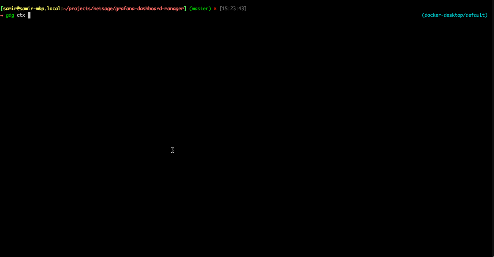

# Grafana dash-n-grab (formerly Grafana Dashboard Manager)

Grafana Dash-n-Grab (GDG) -- Dashboard/DataSource Manager.  The purpose of this project is to provide an easy to use CLI to interact with the grafana API allowing you to backup and restore dashboard and datasources.

Please find the pretty documentation [here](https://software.es.net/gdg/docs/usage_guide/) and the code for updating the docs is available [here](https://github.com/esnet/gdg/blob/master/documentation/content/docs/usage_guide.md)

## Quickstart 

