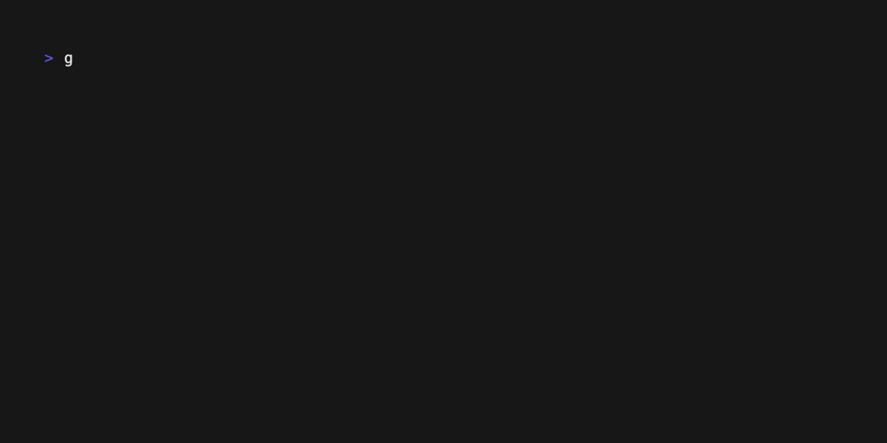

# Grafana dash-n-grab

Grafana Dash-n-Grab (GDG) -- Dashboard/DataSource Manager.  The purpose of this project is to provide an easy-to-use CLI to interact with the grafana API allowing you to backup and restore dashboard, connections (formerly datasources), and other entities.

The following remote backup locations are supported:
  - AWS S3
  - Google Storage
  - Azure Storage
  - S3 Compantible Storage (Minio, Ceph, etc)

Please find the generated documentation [here](https://software.es.net/gdg/) and the code for updating the docs is available [here](https://github.com/esnet/gdg/blob/main/documentation/content/docs/usage_guide.md)

## Quickstart

## Supported Versions

GDG community will try to support the last 2 major version of grafana.  Though there is nothing preventing you from using it with any version of grafana you are dependent on what the API supports/doesn't support and changes that have been added since then.

New features particularly related to Orgs, ACLs, roles etc are far less likely to work the older your version is.

Current Entities supported (See official docs for more details)

 - Connections
 - Dashboards
 - Folders (With Permissions)
 - Organizations
 - Teams
 - Users
 - Library Elements
 - Alerting: 
   - Contact points (master branch only)

Grafana Enterprise Only feature
 - Connection Permissions

## Release conventions.

GDG mostly follows the semver conventions with some minor modifications.

For those that are unfamiliar semver referes to X.Y.Z version patterns with

  - X = Major version
  - Y = Minor version
  - Z= patch

Most regular releases will increment the patch number.  ie. 0.4.5 is a regular release, and next normal release would be 0.4.6.

Minor version change will likely introduce some breaking change.   For example, renaming datasources to connections or some
configuration changes that are not backward compatible etc.

Major version: Is a major feature set change for example, removing cloud support in the base release and introducing a plugin system
would be 1.X release.  Splitting the GDG binary into a tools and backup cli, or introducing a diff tooling that allow you to compare
contexts.  i.e.  `gdg diff dashboards prod staging` is a major divergences from the current expectations so it'll be a major version bump.

For more info, please see the release notes and documentation both available [here](https://software.es.net/gdg/)
